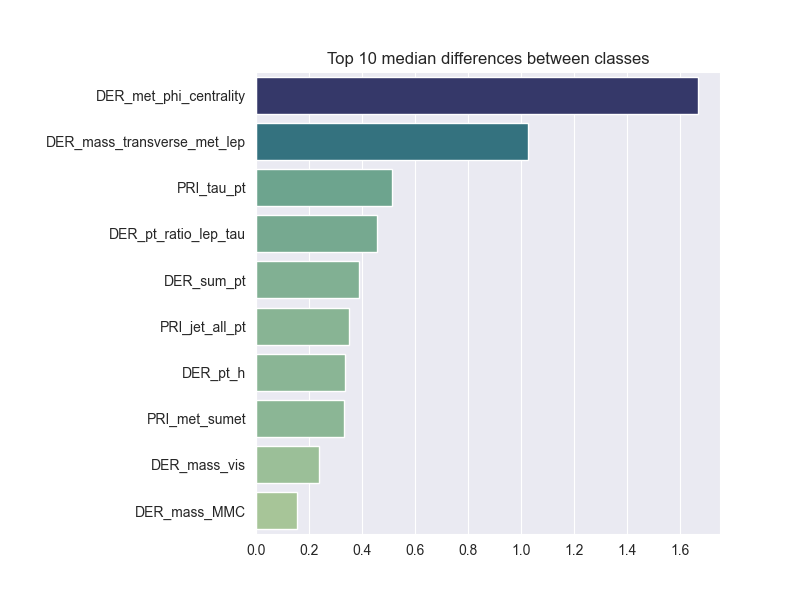
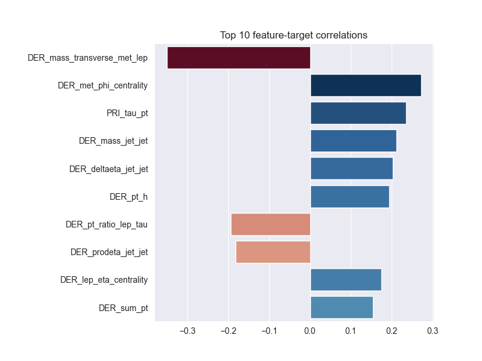
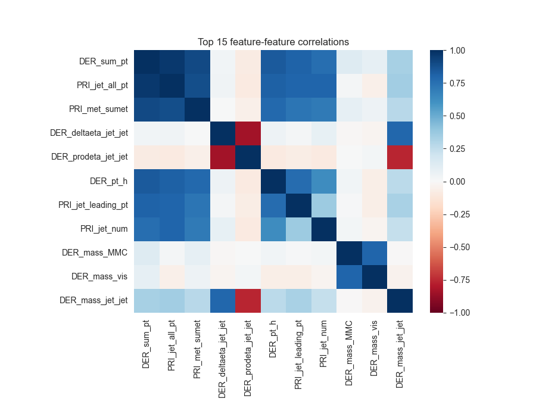
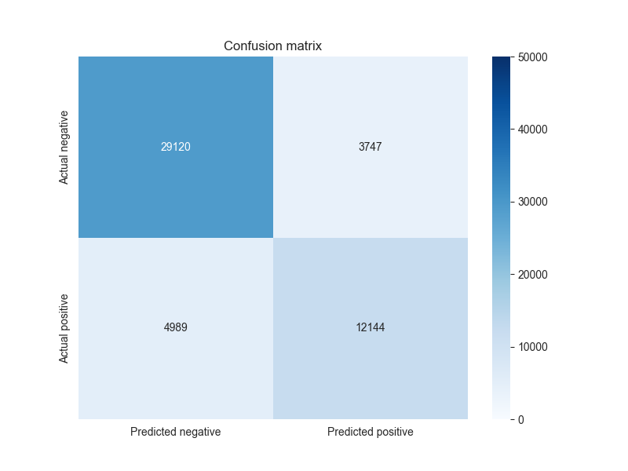
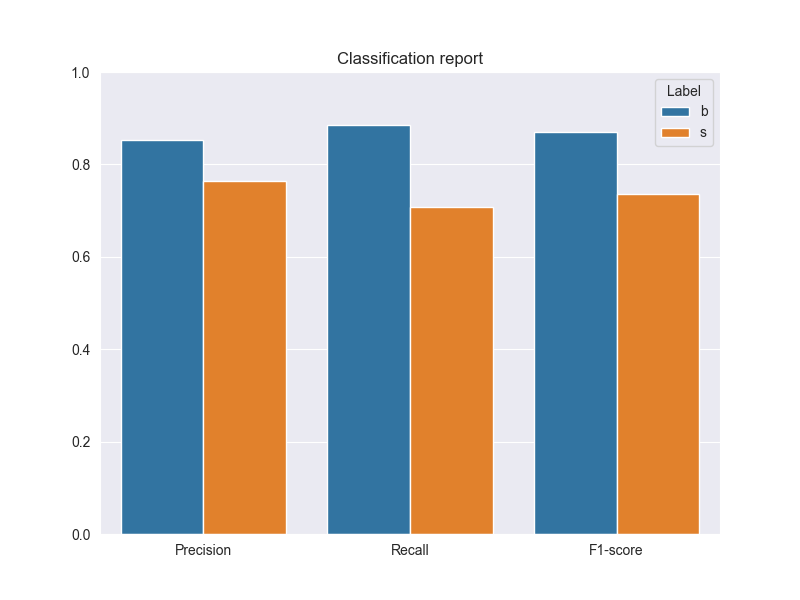
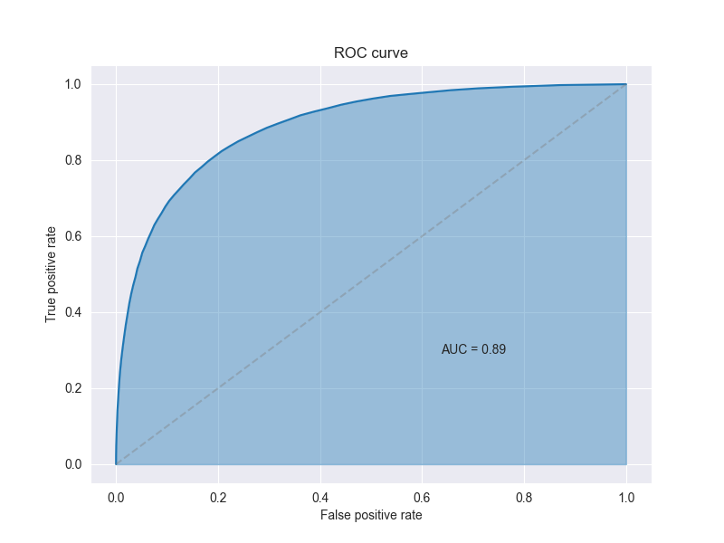

# Particle physics event classification

This is a supervised machine learning model for a [particle physics event classification dataset](https://www.kaggle.com/datasets/younusmohamed/particle-physics-event-classification-dataset?select=README.md).

## Preprocessing the data

The dataset contains 250,000 rows (events) and 33 columns (an event ID, 30 feature variables, a target variable, and a weight variable). Each event is classified as either a signal (s) or background (b), which is the basis of prediction for our supervised learning model.

We first perform an 80-20 train-test split of the data. The feature medians from the training set are used to impute the missing values in both sets. Similarly, the feature means and standard deviations from the training set are used to scale the values in both sets via z-score normalisation. This ensures that there is no data leakage.

Note: The dataset creator recommends passing the weight variable to the `sample_weight` parameter during training and testing, as an indicator of the experimental importance of events. But one cannot know _a priori_ which experiments will be important. For this reason, we do not use this variable. An alternative approach is to view this variable as the target for a regression-based model.

## Analysing and selecting features

First, we split each feature by class and note the difference of the two medians. Since the median is a good measure of the skewness of a distribution, this helps us identify the features for which the data reasonably distinguishes the class. We select the 10 features with the highest difference in medians.

Next, we compute each feature's correlation with the target. Even though it appears as though there is no correlation, it simply means that the actual correlation is not linear. We still eliminate the features that are essentially uncorrelated (absolute value less than 0.15) with the target.

From this list of target-correlated features, we must also eliminate those that contribute redundant information to the target. That is, we must select just one feature from every set of strongly intercorrelated features. To identify these sets, we compute the correlation matrix for features and fix the threshold of strength (absolute value greater than 0.75). The best feature in each set is then selected as the one that is most strongly correlated with the target.

On combining this reduced target-correlated feature list with that based on the difference in medians, we end up with 12 features instead of 30.

## Developing the model

We implement the non-parametric K-nearest neighbours algorithm as the classifier in our model. As recommended by the dataset creator, we use the ROC AUC score to measure its performance. Before hyperparameter tuning, the ROC AUC score of our model is 0.85.

For hyperparameter tuning, we first conduct a broad grid search with 4-fold cross-validation over `n_neighbors: range(5, 205, 10)` and `p: [1, 2]`. Based on the scores, we further refined the tuning by fixing the Manhattan metric (`p=1`) and conducting another grid search with 4-fold cross-validation over `n_neighbours: range(37, 64, 2)`. The best set of hyperparameters turns out to be `n_neighbors=57` and `p=1`, which yields the following results.

## Comparing scores

A more comprehensive analysis of the dataset and several other models were considered in this [Kaggle notebook](https://www.kaggle.com/code/sumedh1507/particle-physics-event-insights). On comparing their scores against those of our model, it takes a little effort to see that only the random forest algorithm outperforms the nearest neighbours algorithm on this dataset; the other models exemplify the misleading nature of ROC AUC scores, given their incredibly low recognition of signals. If we dig deeper, we see that our model is actually on par with the random forest model. The discrepancy can be attributed to the use of weighted metrics, which bumps our 0.89 ROC AUC score up to 0.92.
